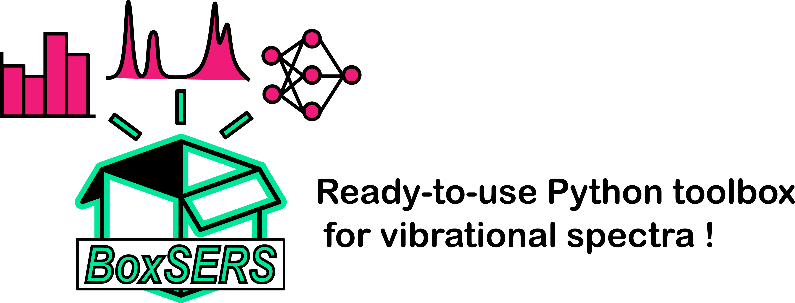
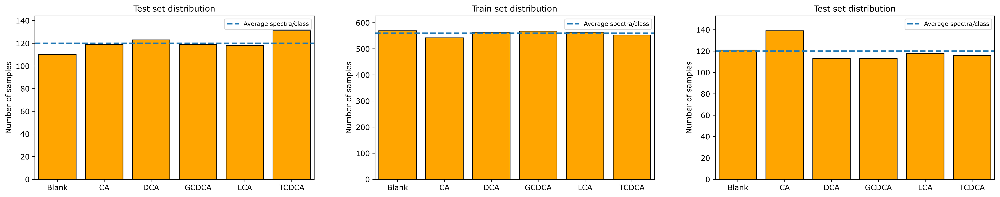
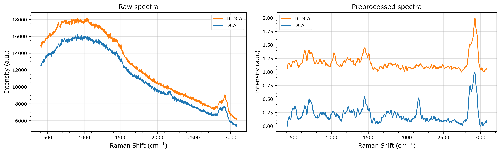
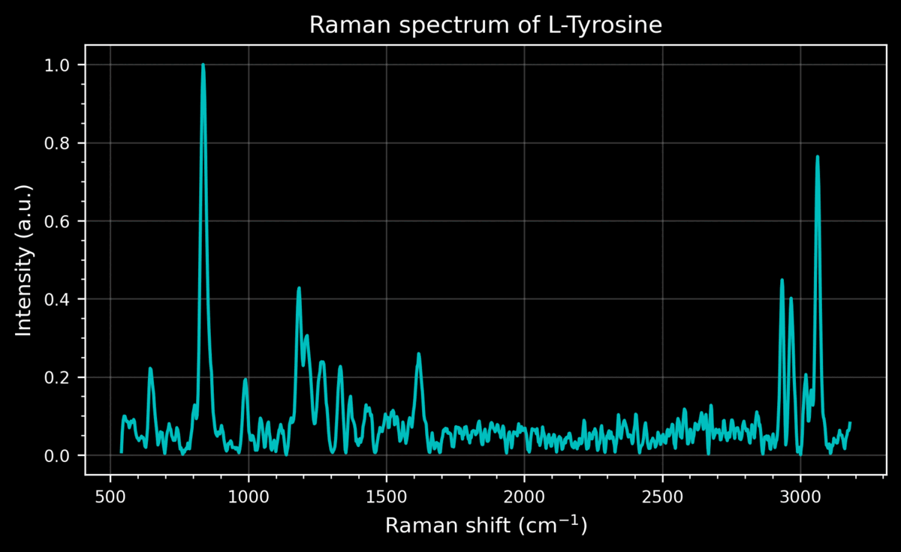
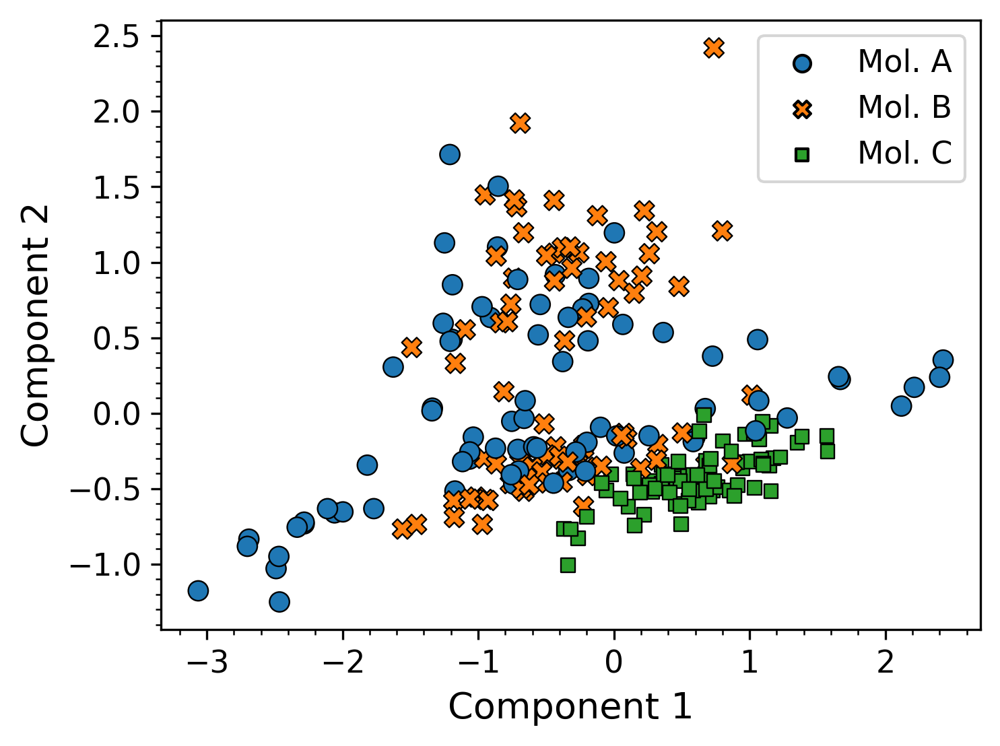

----
[](https://zenodo.org/badge/latestdoi/273074387)
[](https://github.com/ALebrun-108/BoxSERS/blob/master/LICENSE.txt)
[](https://www.python.org/)
[](https://github.com/ALebrun-108/BoxSERS/graphs/commit-activity)

**BoxSERS**, a powerful and ready-to-use python package providing several tools for the analysis of 
vibrational spectra (Raman, FTIR, SERS, etc.), including features for data augmentation, 
dimensional reduction, spectral correction and both supervised and unsupervised machine learning.

## General info on the repository
This GitHub repository includes the following elements : 

* **BoxSERS package** : Complete and ready-to-use python library includind  for the application of methods designed and adapted for vibrational spectra(RamSERS, etc.)


* **Jupyter notebooks** : Typical examples of BoxSERS package usage.
  

* **Raw data** :  Database of SERS bile acid spectra that were used (Raw and Preprocess form) in the article submitted by *Lebrun and Boudreau (2022)* (https://doi.org/10.1177/00037028221077119) can be used as a starting point to start using the BoxSERS package.


Below, on this page, there is also the package's installation guideline and an overview of its main functions.

## Table of contents
* [Getting Started](#getting-started)
  * [BoxSERS Installation](#boxsers-installation)
  * [Requirements](#requirements)
  * [Label Information](#label-information)
* [Included Features](#included-features)
  * [Module misc_tools](#module-misc_tools)
  * [Module visual_tools](#module-visual_tools)
  * [Module preprocessing](#module-preprocessing)
  * [Module data augmentation](#module-data_augmentation)
  * [Module dimension reduction](#module-dimension_reduction)
  * [Module clustering](#module-clustering)
  * [Module classification](#module-classification)
  * [Module validation_metrics](#module-validation_metrics)


## Getting Started 

It is advisable to start with the Jupyter notebook  that present the complete procedure and describe each step in detail while adding information to facilitate understanding. 

**This project doesn't cover database conception yet and requires user to have
completed this step before using this project**. Please take a look at the following Python modules from other users, which allow you to import spectra in various formats:

- [spe2py](https://github.com/ashirsch/spe2py) Princeton Instruments LightField (SPE 3.x) file
- [pyspectra](https://github.com/OEUM/PySpectra)  .spc and .dx file format 

### BoxSERS Installation

From PypY
```bash
pip install boxsers
```

From Github 
```bash
pip install git+https://github.com/ALebrun-108/BoxSERS.git
```

### Requirements
Listed below are the main modules needed to operate the codes: 

* Sklearn
* Scipy
* Numpy
* Pandas
* Matplotlib
* Tensor flow 

To use GPU computing units, it may be necessary to import  `cudnn` and `cudatoolkit` packages using conda or pip.

### Label information

The labels associated with the spectra can be either integer values (single column) or binary values (multiple columns).


#### Example of labels for three classes that correspond to three bile acids:

| Bile acid  	| Integer label (1 column) 	| Binary label (3 columns) 	|
|------------------	|:-------------:	|:------------:	|
| Cholic acid          	|       0       	|    [1 0 0]   	|
| Lithocholic acid        	|       1       	|    [0 1 0]   	|
| Deoxycholic acid        	|       2       	|    [0 0 1]   	|

## Included Features
This section includes the detailed description (utility, parameters, ...) for each function and
class contained in the BoxSERS package
___

### Module ``misc_tools``
This module provides functions for a variety of utilities.

* **data_split** : Randomly splits an initial set of spectra into two new subsets named in this
  function: subset A and subset B.


* **ramanshift_converter** : Converts wavelength [nm] to Raman shifts [cm-1].


* **wavelength_converter** : Convert Raman shifts [cm-1] to wavelengths [nm].


* **load_rruff** : Export a subset of Raman spectra from the RRUFF database in the form of three related lists
  containing Raman shifts, intensities and mineral names.


### Module ``visual_tools``
This module provides different tools to visualize vibrational spectra quickly.

* **spectro_plot :** Returns a plot with the selected spectrum(s)


* **random_plot :** Plot a number of randomly selected spectra from a set of spectra.


* **distribution_plot :** Return a bar plot that represents the distributions of spectra for each classes in
  a given set of spectra

```python
# Code example:
import pandas as pd
import numpy as np
from sklearn.preprocessing import StandardScaler, LabelEncoder, LabelBinarizer

from boxsers.misc_tools import data_split
from boxsers.visual_tools import distribution_plot


df = pd.read_hdf('Bile_acids_27_07_2020.h5', key='df')  # Load bile acids dataframe
wn = np.load('Raman_shift_27_07_2020.npy')  # Load Wavenumber (Raman shift)
classnames = df['Classes'].unique()  

display(df)  # Prints a detailed overview of the imported dataframe "df"

# Features extraction: Exports dataframe spectra as a numpy array (value type = float64).
sp = df.iloc[:, 1:].to_numpy()
# Labels extraction: Export dataframe classes into a numpy array of string values.
label = df.loc[:, 'Classes'].values


# String to integer labels conversion: 
labelencoder = LabelEncoder()  # Creating instance of LabelEncoder
lab_int = labelencoder.fit_transform(label)  # 0, 3, 2, ...

# String to binary labels conversion: 
labelbinarizer = LabelBinarizer()  # Creating instance of LabelBinarizer
lab_binary = labelbinarizer.fit_transform(label)  # [1 0 0 0] [0 0 0 1] [0 1 0 0], ...


# Train/Validation/Test sets splitting 
(sp_train, sp_b, lab_train, lab_b) = data_split(sp, label, b_size=0.30, rdm_ste=None, print_report=False)
(sp_val, sp_test, lab_val, lab_test) = data_split(sp_b, lab_b, b_size=0.50, rdm_ste=None, print_report=False)

# Visualization of spectrum distributions
distribution_plot(lab_train, class_names=classnames, avg_line=True, title='Train set distribution')
distribution_plot(lab_val, class_names=classnames, avg_line=True, title='Validation set distribution')
distribution_plot(lab_test, class_names=classnames, avg_line=True, title='Test set distribution')
```



### Module ``preprocessing``
This module provides functions to preprocess vibrational spectra. These features
improve spectrum quality and can improve performance for machine learning applications.

* **als_baseline_cor** : Subtracts the baseline signal from the spectrum(s) using an
  Asymmetric Least Squares estimation.


* **spectral_normalization** : Normalizes the spectrum(s) using one of the available norms in this function.


* **savgol_smoothing** : Smoothes the spectrum(s) using a Savitzky-Golay polynomial filter.


* **cosmic_filter** : Applies a median filter to the spectrum(s) to remove cosmic rays.


* **spectral_cut** : Subtracts or sets to zero a delimited spectral region of the spectrum(s).


* **spline_interpolation** : Performs a one-dimensional interpolation spline on the spectra to reproduce
  them with a new x-axis.

```python
# Code example:
import numpy as np
from boxsers.preprocessing import savgol_smoothing, als_baseline_cor, spectral_normalization
from boxsers.visual_tools import spectro_plot

# Two spectrum are selected randomly 
random_index = np.random.randint(0, sp.shape[0]-1, 2)
sp_sample = sp[random_index]  # selected spectra
label_a = label[random_index[0]]  # class corresponding to the first spectrum
label_b = label[random_index[1]]  # class corresponding to the second spectrum

# 1) Subtracts the baseline signal from the spectra
sp_bc = als_baseline_cor(sp_sample, lam=1e4, p=0.001, niter=10, return_baseline=False)
# 2) Smoothes the spectra
sp_bc_svg = savgol_smoothing(sp_bc, window_length=15, p=3, degree=0)
# 3) Normalizes the spectra 
sp_bc_svg_norm = spectral_normalization(sp_bc_svg, norm='minmax')

# Graphs visualization : 
legend=(label_a, label_b)
spectro_plot(wn, sp_sample, title='Raw spectra', legend=legend')
spectro_plot(wn, sp_bc_svg_norm[0], sp_bc_svg_norm[1], y_space=1, title='Preprocessed spectra', legend=legend)
```


```python
# darktheme = True/False enables two different display options!
spectro_plot(wn, sp, title='Raman spectrum of L-Tyrosine', darktheme=False)
spectro_plot(wn, sp, title='Raman spectrum of L-Tyrosine', darktheme=True)  
```



### Module ``data_augmentation``
This module provides funtions to generate new spectra by adding different variations to
existing spectra.

* **aug_mixup** : Randomly generates new spectra by mixing together several spectra with a Dirichlet
  probability distribution.


* **aug_noise** : Randomly generates new spectra with Gaussian noise added.


* **aug_multiplier** : Randomly generates new spectra with multiplicative factors applied.


* **aug_offset** : Randomly generates new spectra shifted in intensity.


* **aug_xshift** : Randomly generates new spectra shifted in wavelength.


* **aug_linslope** : Randomly generates new spectra with additional linear slopes


### Module ``dimension_reduction``
This module provides different techniques to perform dimensionality reduction of
vibrational spectra.

* **SpectroPCA** : Principal Component Analysis (PCA) model object.

```python
pca_model = SpectroPCA(n_comp=10)
pca_model.fit_model(sp)
pca_model.scatter_plot(sp, label, component_x=1, component_y=2, fontsize=13, class_names=['Mol. A', 'Mol. B', 'Mol. C']) 
```


### Module ``clustering``
This module provides unsupervised learning models for vibrational spectra cluster analysis.

* **SpectroKmeans** : K-Means clustering model.


* **SpectroGmixture** : Gaussian mixture probability distribution model.


### Module ``classification``
This module provides supervised learning models for vibrational spectra classification.

* **SpectroRF** :  Random forest classification model.


* **SpectroSVM** : Support Vector Machine classification model.


* **SpectroLDA** : Linear Discriminant Analysis classification model


### Module ``neural_networks``
This module provides neural network model specifically designed for the
classification of vibrational spectra.

* **SpectroCNN** : Convolutional Neural Network (CNN) for vibrational spectra classification.


### Module ``validation_metrics``
This module provides different tools to evaluate the quality of a model’s predictions.

* **cf_matrix** :  Returns a confusion matrix (built with scikit-learn) generated on a given set of spectra.
    

* **clf_report** : Returns a classification report generated from a given set of spectra
